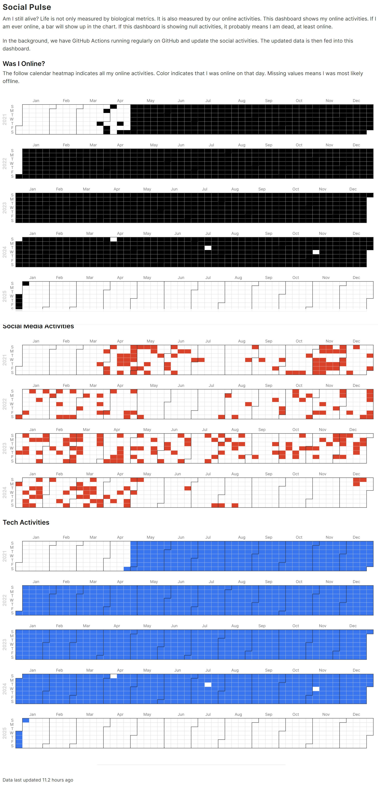

# social-pulse

Automated collection of social activities using GitHub Actions.

[Demo](https://pulse.leima.is/)


## How it works?

There are two components in this repo

1. Data collection: the python code in `pulse` folder will be executed regularly using cronjob in GitHub Actions.
2. Dashboard: the frontend code in `dashboard` folder takes the data and visualizes it.

## How to set up your own pulse?

Fork the repo, and change the configs.

1. Fork the repo. Make sure to allow GitHub Actions when forking.
2. Remove the data files in `dashboard/data`.
3. Change the `CNAME` file to adjust to your own domain name if needed. Otherwise, delete the file.
3. Change the configs (see below).

### Change the Configs

The config file is located in `configs/config.json`.

Change all the `user_id` fields in the config. Check the details of the `//` comments in the following example.

```
{
    "name": "social pulse",
    "base_folder": "dashboard/data",
    "enabled": [
        ["douban", "book_movie_music"]
    ],
    "combined": {
        "artifacts": {
            "local": "pulses.json"
        }
    },
    "social": {
        "douban": {
            "book_movie_music": {
                "user_id": "emptymalei",   // Replace it with your own douban id
                "artifacts": {
                    "local": "douban/douban__book_movie_music.json"
                }
            },
            "status": {
                "user_id": "1587390",      // Replace it with your own douban id, only numerical id is supported: https://docs.rsshub.app/social-media.html#dou-ban
                "artifacts": {
                    "local": "douban/douban__status.json"
                }
            }
        },
        "github": {
            "events": {
                "user_id": "emptymalei",    // Replace it with your GitHub id.
                "artifacts": {
                    "local": "github/github__events.json"
                }
            }
        }
    }
}
```

# Evidence

```bash
npm install
npm run sources
npm run dev -- --host 0.0.0.0
```

See [the CLI docs](https://docs.evidence.dev/cli/) for more command information.

**Note:** Codespaces is much faster on the Desktop app. After the Codespace has booted, select the hamburger menu → Open in VS Code Desktop.

## Get Started from VS Code

The easiest way to get started is using the [VS Code Extension](https://marketplace.visualstudio.com/items?itemName=Evidence.evidence-vscode):


1. Install the extension from the VS Code Marketplace
2. Open the Command Palette (Ctrl/Cmd + Shift + P) and enter `Evidence: New Evidence Project`
3. Click `Start Evidence` in the bottom status bar

## Get Started using the CLI

```bash
npx degit evidence-dev/template my-project
cd my-project
npm install
npm run sources
npm run dev
```

Check out the docs for [alternative install methods](https://docs.evidence.dev/getting-started/install-evidence) including Docker, Github Codespaces, and alongside dbt.


## Learning More

- [Docs](https://docs.evidence.dev/)
- [Github](https://github.com/evidence-dev/evidence)
- [Slack Community](https://slack.evidence.dev/)
- [Evidence Home Page](https://www.evidence.dev)
