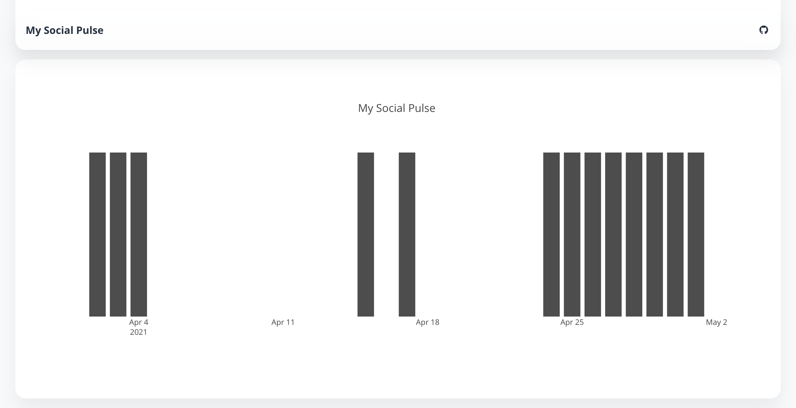

# social-pulse

Automated collection of social activities using GitHub Actions.

[Demo](https://pulse.leima.is/)


## How it works?

There are two components in this repo

1. Data collection: the python code in `pulse` folder will be executed regularly using cronjob in GitHub Actions.
2. Dashboard: the frontend code in `dashboard` folder takes the data and visualizes it.

## How to set up your own pulse?

Fork the repo, and change the configs.

1. Fork the repo. Make sure to allow GitHub Actions when forking.
2. Remove the data files in `dashboard/data`.
3. Change the `CNAME` file to adjust to your own domain name if needed. Otherwise, delete the file.
3. Change the configs (see below).

### Change the Configs

The config file is located in `configs/config.json`.

Change all the `user_id` fields in the config. Check the details of the `//` comments in the following example.

```
{
    "name": "social pulse",
    "base_folder": "dashboard/data",
    "enabled": [
        ["douban", "book_movie_music"]
    ],
    "combined": {
        "artifacts": {
            "local": "pulses.json"
        }
    },
    "social": {
        "douban": {
            "book_movie_music": {
                "user_id": "emptymalei",   // Replace it with your own douban id
                "artifacts": {
                    "local": "douban/douban__book_movie_music.json"
                }
            },
            "status": {
                "user_id": "1587390",      // Replace it with your own douban id, only numerical id is supported: https://docs.rsshub.app/social-media.html#dou-ban
                "artifacts": {
                    "local": "douban/douban__status.json"
                }
            }
        },
        "github": {
            "events": {
                "user_id": "emptymalei",    // Replace it with your GitHub id.
                "artifacts": {
                    "local": "github/github__events.json"
                }
            }
        }
    }
}
```

# Dashboard


This is an [Observable Framework](https://observablehq.com/framework/) app. To install the required dependencies, run:

```
npm install
```

Then, to start the local preview server, run:

```
npm run dev
```

Then visit <http://localhost:3000> to preview your app.

For more, see <https://observablehq.com/framework/getting-started>.

## Project structure

A typical Framework project looks like this:

```ini
.
├─ src
│  ├─ components
│  │  └─ timeline.js           # an importable module
│  ├─ data
│  │  ├─ launches.csv.js       # a data loader
│  │  └─ events.json           # a static data file
│  ├─ example-dashboard.md     # a page
│  ├─ example-report.md        # another page
│  └─ index.md                 # the home page
├─ .gitignore
├─ observablehq.config.js      # the app config file
├─ package.json
└─ README.md
```

**`src`** - This is the “source root” — where your source files live. Pages go here. Each page is a Markdown file. Observable Framework uses [file-based routing](https://observablehq.com/framework/project-structure#routing), which means that the name of the file controls where the page is served. You can create as many pages as you like. Use folders to organize your pages.

**`src/index.md`** - This is the home page for your app. You can have as many additional pages as you’d like, but you should always have a home page, too.

**`src/data`** - You can put [data loaders](https://observablehq.com/framework/data-loaders) or static data files anywhere in your source root, but we recommend putting them here.

**`src/components`** - You can put shared [JavaScript modules](https://observablehq.com/framework/imports) anywhere in your source root, but we recommend putting them here. This helps you pull code out of Markdown files and into JavaScript modules, making it easier to reuse code across pages, write tests and run linters, and even share code with vanilla web applications.

**`observablehq.config.js`** - This is the [app configuration](https://observablehq.com/framework/config) file, such as the pages and sections in the sidebar navigation, and the app’s title.

## Command reference

| Command           | Description                                              |
| ----------------- | -------------------------------------------------------- |
| `npm install`            | Install or reinstall dependencies                        |
| `npm run dev`        | Start local preview server                               |
| `npm run build`      | Build your static site, generating `./dist`              |
| `npm run deploy`     | Deploy your app to Observable                            |
| `npm run clean`      | Clear the local data loader cache                        |
| `npm run observable` | Run commands like `observable help`                      |
